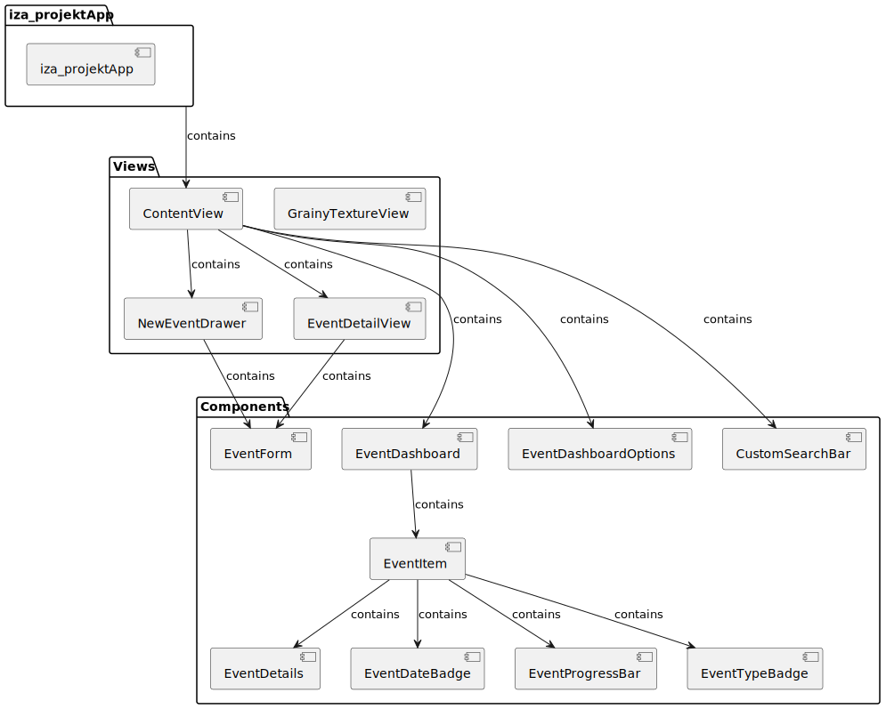

 

# ImBadAtTimeManagementAndForgetEverything

**IZA project 2023/2024 @ FIT BUT**

Author: Tomáš Hobza ([xhobza03](mailto:xhobza03@vutbr.cz))

---

## 👋 Introduction

This repository contains an iOS app create as a part of the IZA (*Programování zařízení Apple/Apple device programming*) course on FIT BUT. The app is a simple TODO-like app aimed at solving the chaos of managing univeristy projects.

## ✨ Features

The app is based on a very simple idea - the efficiency of displaying data plays a crucial role in the way we, humans, process it. There are a lot of solutions aimed at this specific target problem, but they either try to pack as many features in as possible - thus creating even more chaos - or they are too basic - missing features that make the app impractical for university projects.

*What is the main purpose of this app?* A simple intuitive dashboard for quickly cheking the status of tasks. Essentially, the dashboard is meant to be looked at at the beginning of the day for a „What do I have to do today?“ check.

## 📊 Data model

*Caption: Class diagram of the data model*

In terms of persistent data, the model is pretty simple. Each user has a list of events, where each event has a specific type. Events can also have tasks. Tasks represent subproblems of the whole event that help the user keep track of how much the user has completed already.

The application uses SwiftData to handle persistency of data. A more complex version might utilize the CloudKit to sync the persistent data across multiple devices.

## Component Tree

*Caption: Component tree diagram*

The whole UI is made up of components (views). As I have a major background in web development, this concept is very similar in SwiftUI. Every component is in itself a view, but I‘ve split them up into two categories - views and components. I make the split based on their intended use. Views here represent sort of a singleton patter - the component is meant to appear only once in the whole interface. The components group contains those that are meant to be repeatedly displayed or reusable. 

A good example of this it the `EventItem`. This component acts only as a way to display some data in a specific way. It does not have any data of it‘s own - in the MVVM ideology, it is a pure View component.

On the other hand, the `NewEventDrawer` component has functionality to create a new Event entity in the database - thus escaping the idea of a pure View and would classify as a View-Model. (*Of course, the component itself contains both View-Model and View. I mainly mentioned this to illustrate the idea behind the composition of the project.*)

## 📝 Usage examples

| This video showcases the process of creating an event and editing that event. It also shows the filtering/sorting options of the main screen dashboard. |  |
| ------------------------------------------------------------ | ---------------------------------------------- |
| This video showcases the support for dark mode and deleting an Event. |       |

## 🧪 Testing

As the interactivity of the app is not that complex, the testing was mainly done manualy. I have personally used the app while studying for final exams to keep track of my studying progress.

## 📚 Name etymology

The name of the application is quite expressive about what the app is aimed to solve. This is a parody of the recent trend of naming apps with short and non-expressive names. I was also figuring out what the character limit for an iOS app title is.
